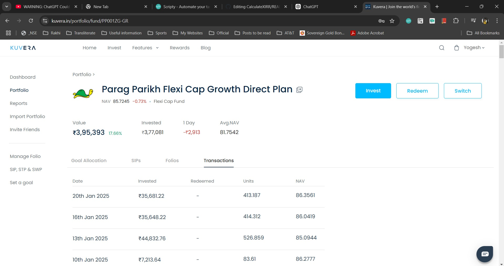
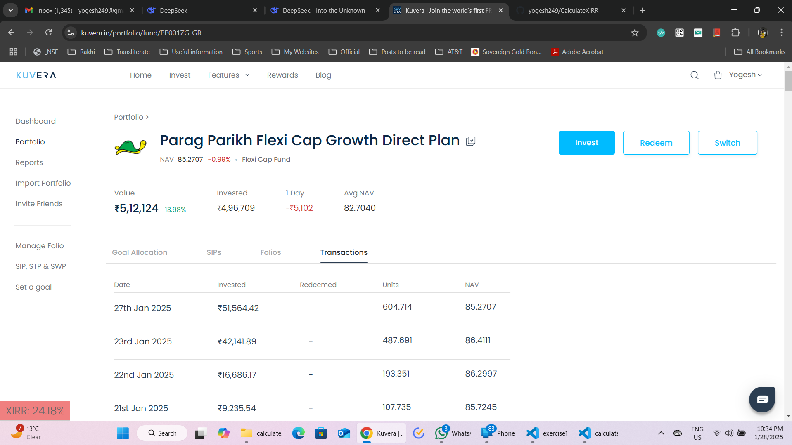

# CalculateXIRR

If I go to kuvera.in and go to mutual funds -> select your mutual fund and go to transactions screen, I will see something like this

Here you can see the overall XIRR is not shown. The one that is shown on the previous screen where all mutual funds of your porfolio are listed, shows the return of the current holding.

I have made a script which can give you the overall return of the mutual fund and that includes all your transactions, all redemptions, investments, everything that you did to this particular fund from day 1.

What you need to do is
1. Install Scripty chrome extension from https://chromewebstore.google.com/detail/scripty-javascript-inject/milkbiaeapddfnpenedfgbfdacpbcbam
2. Go to https://scripty.abhisheksatre.com/#/store and on left click script store
3. look for this script - CalculateXIRRinKuveraTransactionsScreen and click Install
4. go to the page shown in the above screenshot
5. Right click Under Scripty select CalculateXIRRinKuveraTransactionsScreen
6. And you'll be shown the XIRR on the bottom left corner of the page

And here we can see the XIRR
